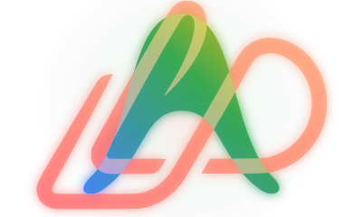

# agy-sandbox

<p align="center">
  
</p>

[](https://pypi.org/project/agy-sandbox/)
[](https://pypi.org/project/agy-sandbox/)
[](LICENSE)

---

## Why does this exist?

Antigravity CLI's default safety constraints require too much manual intervention, but granting the agent full system access is a security risk.

`agy-sandbox` solves this by running the CLI inside an isolated Docker container. This gives the AI agent the freedom to execute tasks autonomously while strictly preventing it from accessing 
or modifying your host machine. In short, the tool minimizes the blast radius if something bad happens.

This Python package is meant to abstract the underlying Docker commands and handle OS-specific configurations, providing a streamlined, cross-platform sandbox out of the box.

---

## Prerequisites

Ensure your system has:
* **Python**: 3.10+
* **Docker**: 24.0+ (and running)

---

## Installation

Install via pip:
```bash
pip install agy-sandbox
```
Or using uv:
```bash
uv pip install agy-sandbox
```

### Install from Source (Development)


#### Clone the repository
```bash
git clone https://github.com/lideta-technologies/agy-sandbox.git
cd agy-sandbox
```
#### Install in development mode (editable)
```bash
uv venv
source .venv/bin/activate   # On Windows: .venv\Scripts\activate
uv pip install -e .
```
---

## Quick Start & Usage

When you run `agy-sandbox` on a project directory, the tool automatically handles the container lifecycles:
* **Running** ➜ Connects directly via `docker exec`.
* **Stopped** ➜ Starts the container, then connects.
* **Nonexistent** ➜ Builds the image, runs the container, and initializes the remote agent session.

```bash
# Provision and start a sandbox (default provider is Google AI Studio)
agy-sandbox /path/to/your/project

# Explicitly specify Vertex AI billing
agy-sandbox /path/to/your/project --provider vertex

# List all sandbox containers
agy-sandbox list

# Stop a sandbox container (accepts current workspace, a custom path, or direct container name)
agy-sandbox stop
agy-sandbox stop /path/to/your/project

# Remove a sandbox container (accepts current workspace, a custom path, or direct container name)
agy-sandbox remove
agy-sandbox remove /path/to/your/project

# View container logs
agy-sandbox logs --follow
```

---

## Switching Providers and Authentication State

AI Studio uses a simple web authentication mechanism. Vertex AI requires a Google Cloud project setup with Application Default Credentials (ADC) configured on your host (`gcloud auth application-default login`). 

Switching between them is not always as simple as changing an environment variable because the Antigravity CLI prioritizes cached Google OAuth sessions over new configurations.

### How to Switch Providers
To switch from Google AI Studio to Google Vertex AI:

1. **Log out of your active session**:
   Inside the active `/workspace` terminal of the container (or from the `agy` prompt), run:
   ```bash
   agy logout
   # (Or type /logout directly in the active agent session)
   ```
2. **Re-run with your new provider**:
   ```bash
   agy-sandbox /path/to/your/project --provider vertex
   ```
3. **Select GCP Project Option**:
   When prompted, choose option **`2. Use a Google Cloud project`**. This bypasses the cached Google AI Studio OAuth flow and forces the CLI to use your mounted ADC credentials.

---

## How It Works (Volume Mounts)

The following host paths are automatically mounted into your isolated container:

| Host Path | Container Path | Purpose |
|-----------|----------------|---------|
| Your project directory | `/workspace` | Project code (live-mounted) |
| `~/.config/antigravity` | `~/.config/antigravity` | Antigravity auth tokens and agent state |
| `~/.gemini` | `~/.gemini_host` (re-mapped) | Google Gemini credentials |
| `~/.cache/uv` | `~/.cache/uv` | Shared python package cache |
| `~/.local/share/uv` | `~/.local/share/uv` | Shared python binaries and environments |

---

## Contributing

We welcome contributions to help improve `agy-sandbox`.

### Development Setup
1. Clone the repository:
   ```bash
   git clone https://github.com/lideta-technologies/agy-sandbox.git
   cd agy-sandbox
   ```
2. Create and activate a virtual environment:
   ```bash
   python3 -m venv .venv
   source .venv/bin/activate
   ```
3. Install dependencies in editable mode:
   ```bash
   pip install -e ".[dev]" pytest pytest-cov
   ```

### Running Tests
Make sure all unit tests run and pass before submitting a pull request:
```bash
pytest --cov=agy_sandbox --cov-report=term-missing
```

---

## License

MIT
